# 📊 System Architecture & Engineering Infographics

A collection of visual maps, architecture diagrams, and concept blueprints created to document and design various systems, automation workflows, and security infrastructures.

---

### 🧠 Automation & Intelligent Systems (AI & ERP)
*   **AI Agent Workflows:**  
    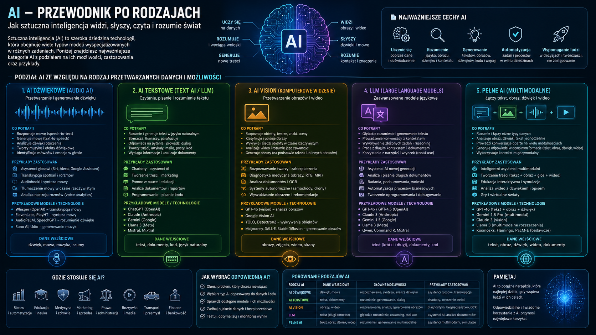
*   **ERP Architecture:**  
    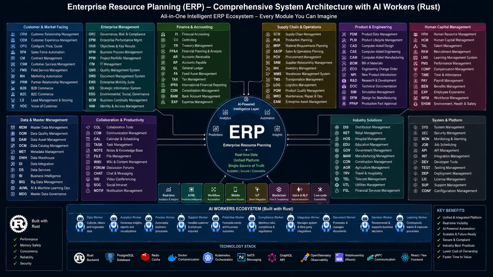
*   **CSOD Core Matrix:**  
    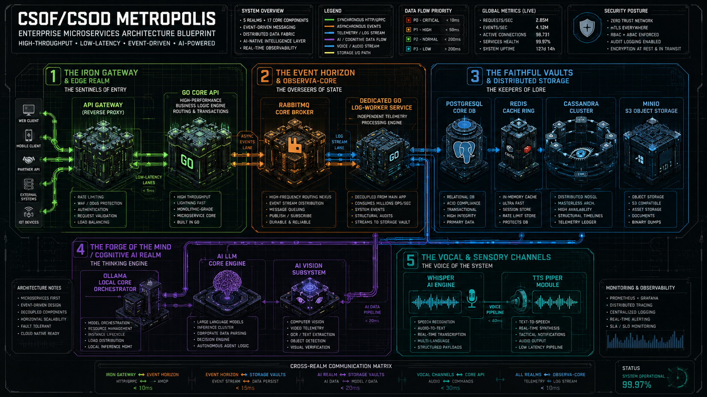

---

### 🛡️ Security & Access Management (SecOps / IAM)
*   **SOC Ecosystem:**  
    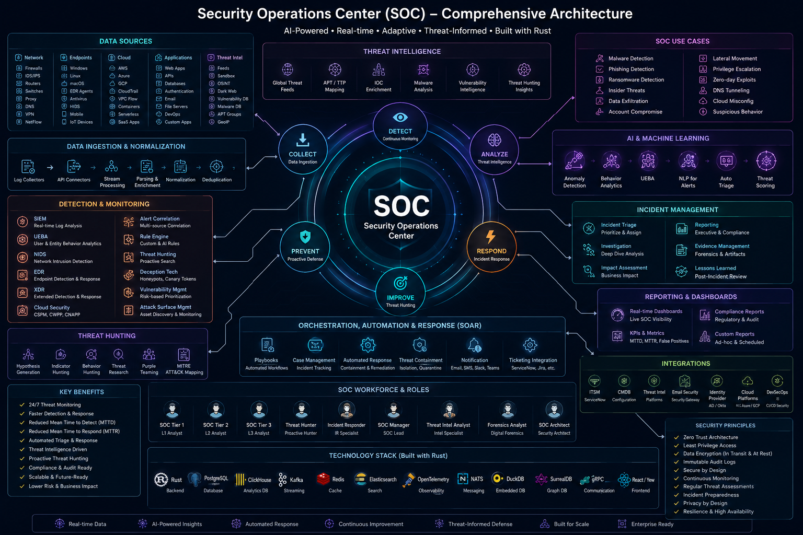
*   **SIEM Logging & Detection:**  
    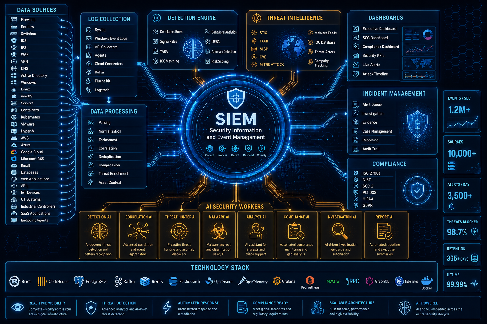
*   **SOAR Automation Playbooks:**  
    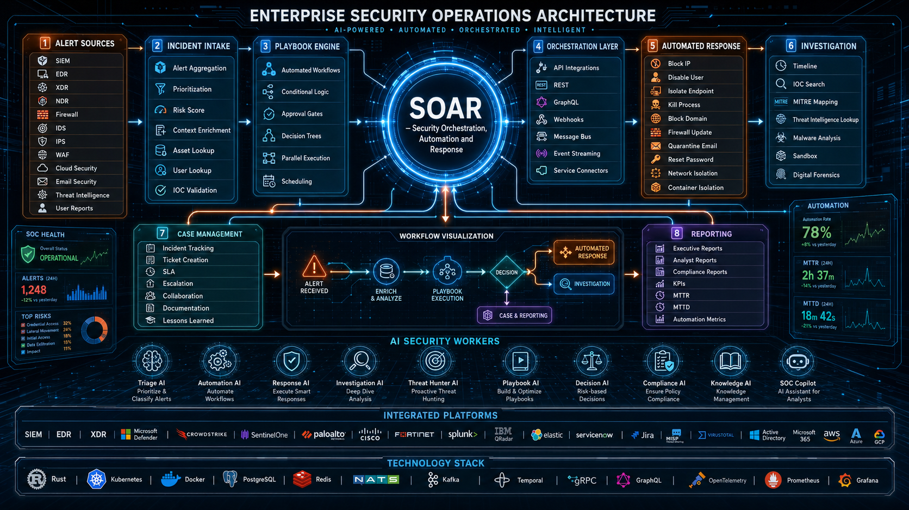
*   **Privileged Access Management (PAM):**  
    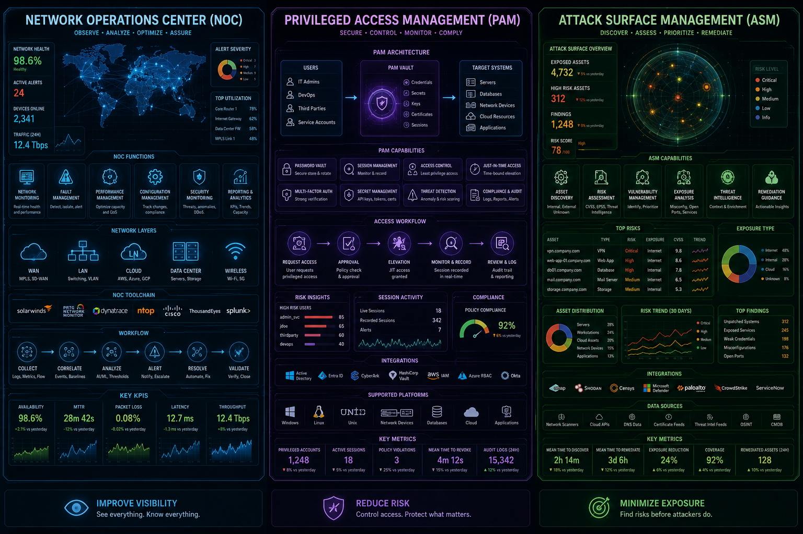
*   **PAM Advanced Architecture:**  
    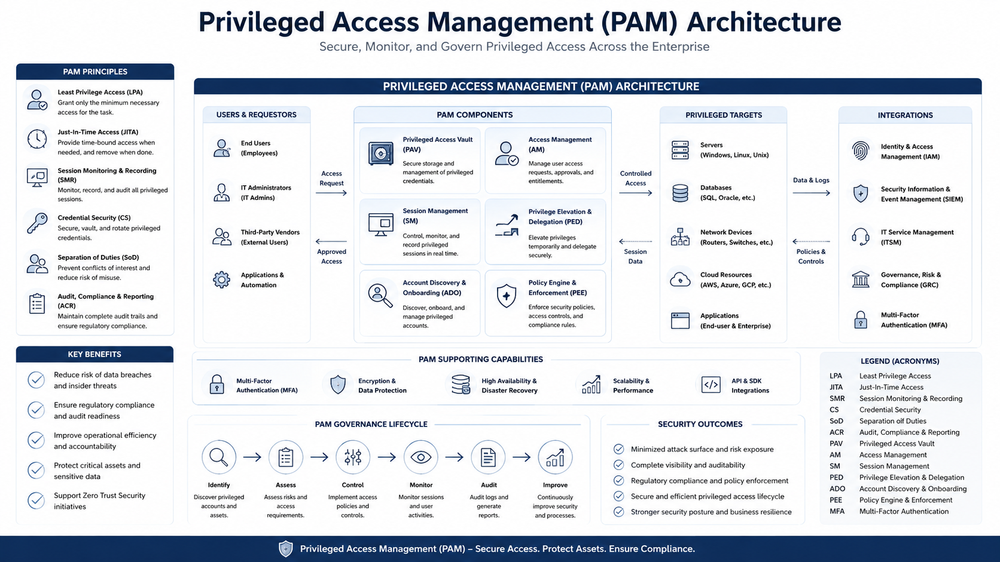

---

### 🌐 Infrastructure, Networks & Hardware (DevOps & Edge)
*   **NOC Monitoring:**  
    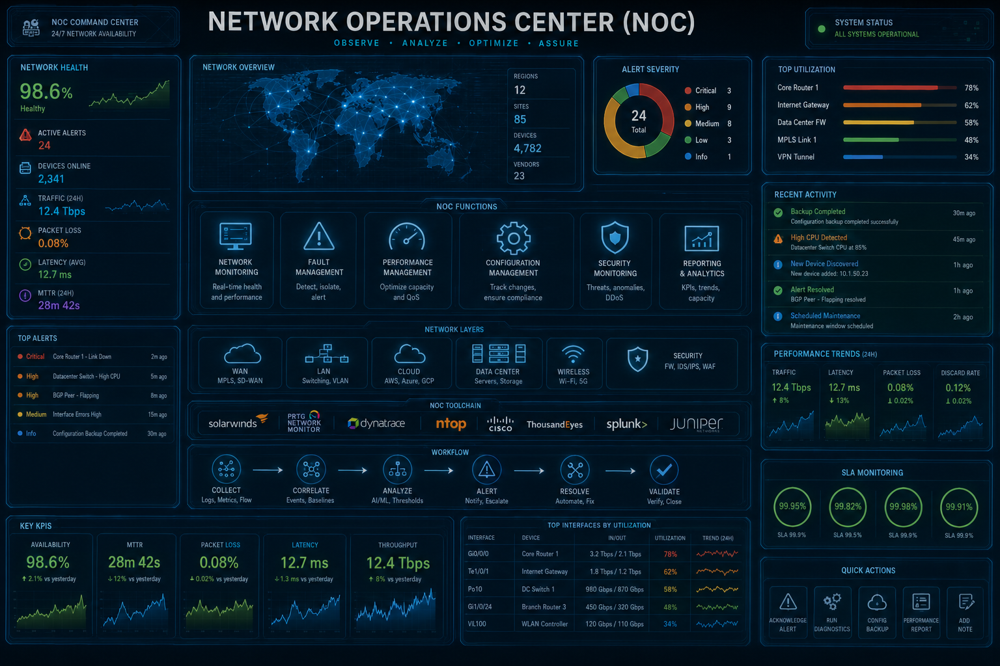
*   **System Architecture (General):**  
    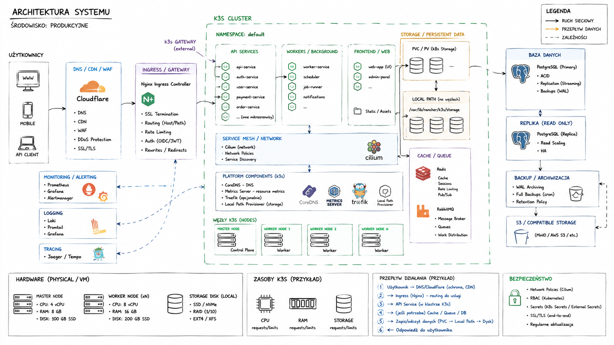
*   **Drone Control & Edge Systems:**  
    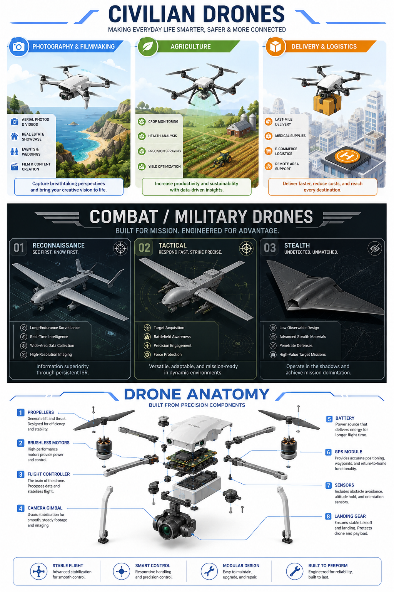
*   **Kassandra Project Blueprint:**  
    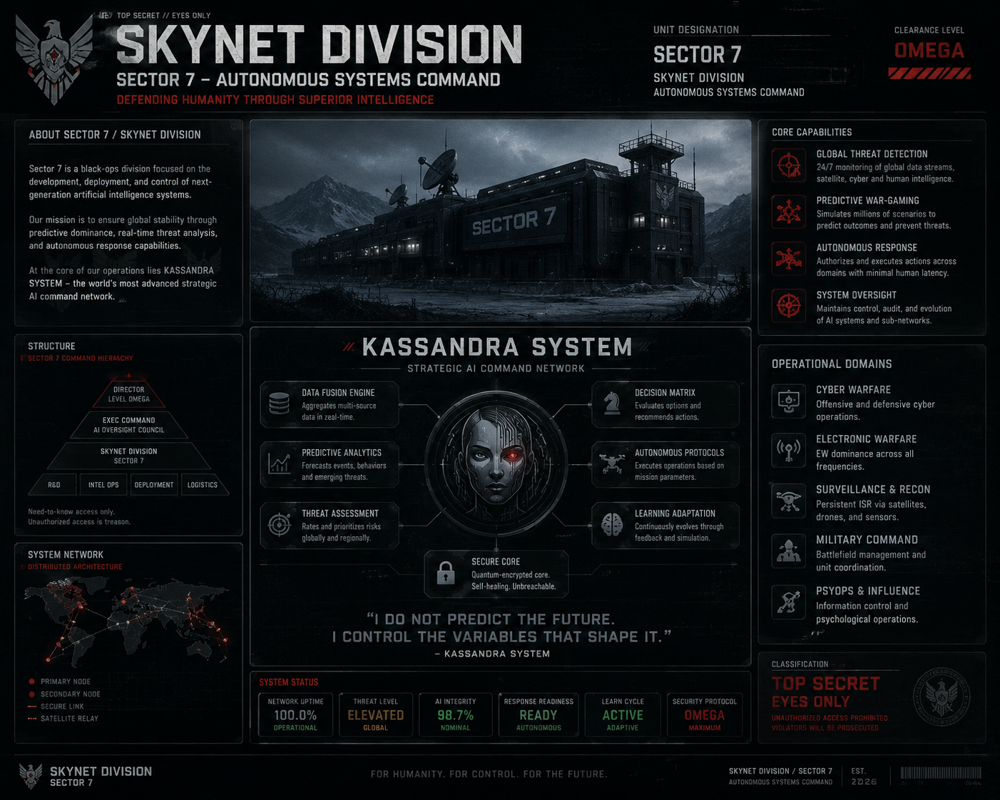
*   **SK-Sector-7 Network Map:**  
    

---

*Note: All diagrams and visuals are subject to updates as underlying architectures evolve.*